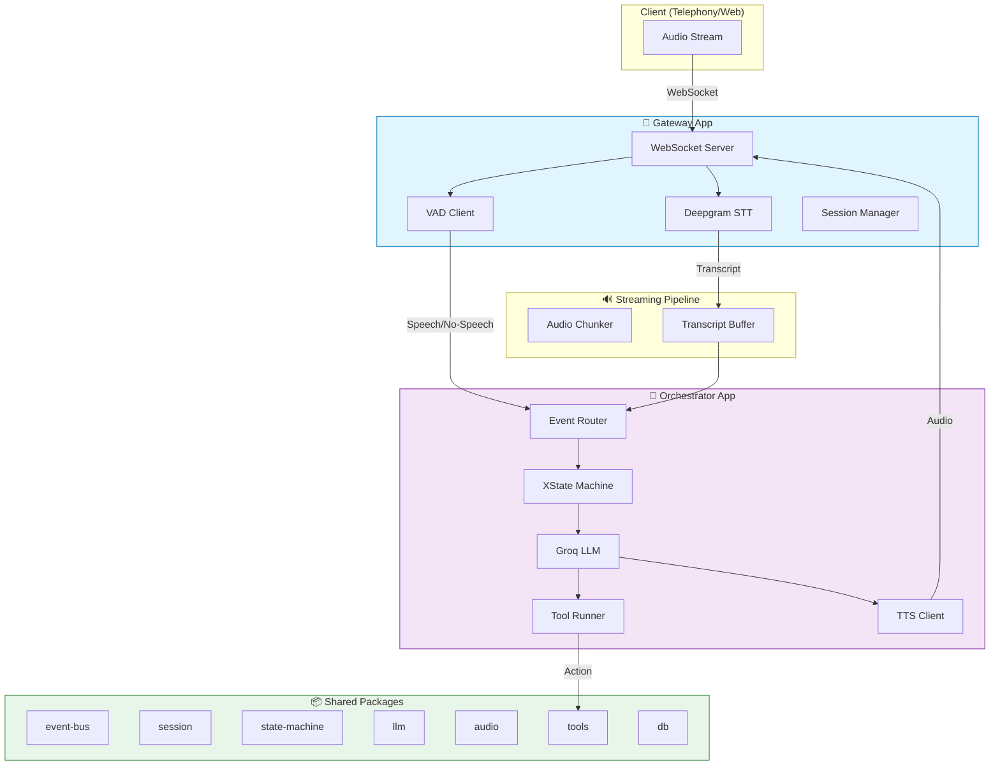
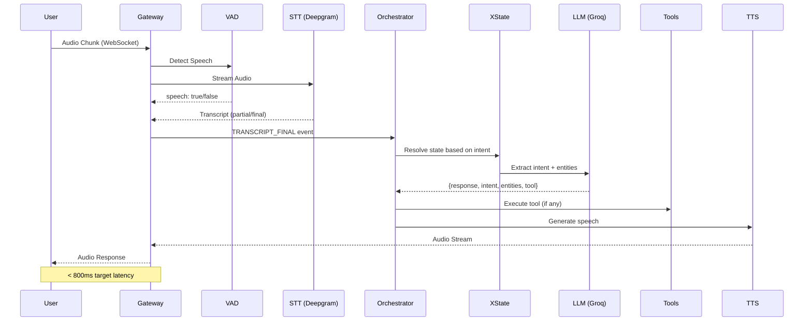
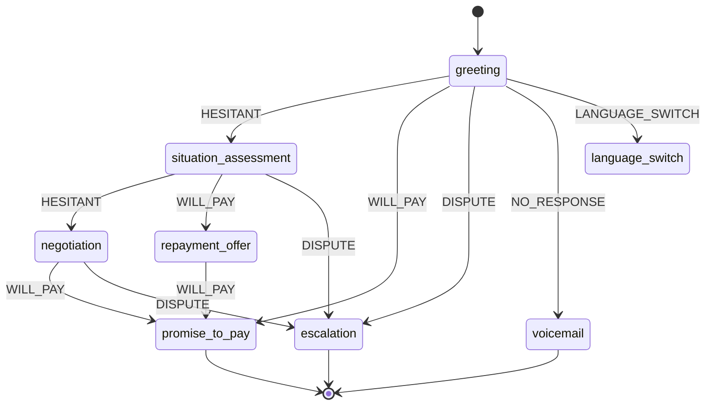

# 🎙️ Riverline - Voice Collections Agent

<p align="center">
  
  
  
  
</p>

> **Real-time, event-driven AI voice agent for autonomous loan collection calls.** Built with deterministic state machines, probabilistic LLM reasoning, and streaming audio pipeline.

## ✨ Key Features

- **🔄 Event-Driven Architecture** - Pure pub/sub event bus, no direct service coupling
- **🧠 State Machine Control** - XState-driven conversation flow, not prompt-driven
- **⚡ Streaming Pipeline** - Real-time STT → LLM → TTS with <800ms latency target
- **🛡️ Interrupt Handling** - User can interrupt agent mid-speech
- **🌐 Bilingual** - Supports Hindi and English out of the box
- **📊 Observability** - Built-in logging, metrics, and latency tracking

---

## 🏗️ Architecture Overview



---

## 🔄 Data Flow



---

## 📁 Project Structure

```
voice-agent/
├── apps/
│   ├── gateway/           # WebSocket entry point
│   ├── orchestrator/      # Brain (events + state + LLM)
│   ├── vad-service/      # Python Voice Activity Detection
│   └── worker/           # Async jobs (WhatsApp, logging)
│
├── packages/
│   ├── shared/           # Types, events, utilities (18 files)
│   ├── session/          # Redis session management
│   ├── state-machine/    # XState collections workflow
│   ├── llm/             # Prompts + output parser
│   ├── audio/           # TTS client + chunking
│   ├── tools/           # Tool registry + executor
│   ├── db/              # PostgreSQL persistence
│   ├── event-bus/       # Pub/sub system
│   ├── observability/   # Logger + metrics + latency
│   └── llm/             # LLM prompts + parser
│
├── infra/               # Docker, GCP configs
└── docs/                # Architecture docs
```

---

## 🧠 How It Works

### State Machine Driven

Unlike traditional LLM-based agents where the model controls conversation flow, **Riverline uses XState to drive the flow**:



### LLM Responsibilities (Split Design)

| Component | Role | Latency |
|-----------|------|---------|
| **Intent Classifier** | Fast intent extraction + entity parsing | ~200ms |
| **Response Generator** | Generate natural speech response | ~400ms |

The LLM **suggests**; the **state machine decides** which state to transition to.

---

## 🚀 Quick Start

### Prerequisites

- Node.js 18+ with pnpm
- Python 3.10+ (for VAD service)
- Redis (optional, for production)

### Installation

```bash
# 1. Install JS dependencies
pnpm install

# 2. Set up Python VAD service
cd apps/vad-service
python -m venv venv
source venv/bin/activate  # or venv\Scripts\activate on Windows
pip install -r requirements.txt

# 3. Configure environment
cp .env.example .env
```

### Environment Variables

```env
# Required
GROQ_API_KEY=your_groq_api_key
DEEPGRAM_API_KEY=your_deepgram_api_key

# Optional (defaults shown)
PORT=8080
ORCHESTRATOR_PORT=8090
VAD_URL=http://localhost:8000
ELEVENLABS_API_KEY=your_elevenlabs_key
```

> **Get free API keys:**
> - [Groq Console](https://console.groq.com/)
> - [Deepgram Console](https://console.deepgram.com/)

### Run Services

```bash
# Terminal 1: VAD Service
cd apps/vad-service
uvicorn app.main:app --reload --port 8000

# Terminal 2: All JS Services
pnpm dev
```

### Connect a Client

```javascript
const ws = new WebSocket('ws://localhost:8080');

ws.onopen = () => {
  // Send audio chunks (base64 encoded)
  ws.send(JSON.stringify({
    type: "AUDIO_CHUNK",
    audio: "base64_audio_data",
    frameMs: 20
  }));
};

ws.onmessage = (event) => {
  const msg = JSON.parse(event.data);
  if (msg.type === "AUDIO_OUT") {
    // Play audio
  }
};
```

---

## 📦 Packages Overview

| Package | Purpose | Key Files |
|---------|---------|-----------|
| `@voice-agent/shared` | Core types & events | `events.ts`, `types.ts`, `retry.ts`, `cache.ts` |
| `@voice-agent/session` | Redis session store | `redis-client.ts`, `session-store.ts` |
| `@voice-agent/state-machine` | Collections workflow | `machine.ts`, `guards.ts` |
| `@voice-agent/llm` | Prompts & parsing | `prompts.ts`, `parser.ts` |
| `@voice-agent/audio` | TTS integration | `tts-client.ts`, `chunker.ts` |
| `@voice-agent/tools` | Tool execution | `registry.ts`, `executor.ts` |
| `@voice-agent/db` | PostgreSQL layer | `client.ts`, `queries.ts`, `schema.sql` |
| `@voice-agent/event-bus` | Pub/sub system | `index.ts` |
| `@voice-agent/observability` | Logging & metrics | `logger.ts`, `latency-tracker.ts` |

---

## 🔌 Event Taxonomy

Events flow through the system via the event bus:

```typescript
type VoiceEvent =
  | { type: "AUDIO_CHUNK"; data: Buffer }
  | { type: "SPEECH_START" }
  | { type: "SPEECH_END" }
  | { type: "TRANSCRIPT_PARTIAL"; text: string }
  | { type: "TRANSCRIPT_FINAL"; text: string }
  | { type: "LLM_RESPONSE"; payload: LlmOutput }
  | { type: "TTS_CHUNK"; audio: Buffer };
```

---

## 🛠️ Available Tools

| Tool | Description |
|------|-------------|
| `log_promise_to_pay` | Record borrower's payment promise |
| `schedule_followup` | Schedule a callback/reminder |
| `flag_dispute` | Flag the call for dispute resolution |

---

## 📊 Observability

Built-in observability features:

```typescript
// Logger with context
const logger = createLogger({ component: "orchestrator" });
logger.info("Processing transcript", { callId, state: "negotiation" });

// Latency tracking
const tracker = createLatencyTracker();
const id = tracker.start("llm_call");
// ... do work ...
tracker.end(id); // Returns { stage, durationMs, metadata }

// Metrics
const metrics = createMetrics();
metrics.increment("transcripts.processed");
metrics.timing("llm.latency", 234);
```

---

## 🔐 Reliability

- **Circuit Breaker** - Auto-switch to scripted flow if LLM fails 3x
- **Retry with Backoff** - Exponential backoff for transient failures
- **Graceful Shutdown** - Clean up resources on SIGTERM
- **Rate Limiting** - Per-client rate limits built-in

---

## 📈 Performance Targets

| Metric | Target |
|--------|--------|
| User stops speaking → Agent starts | < 800ms |
| STT Latency | < 300ms |
| LLM Response | < 500ms |
| TTS Generation | < 200ms |

---

## 🤝 Contributing

1. Fork the repo
2. Create a feature branch
3. Make changes with tests
4. Submit a PR

---

## 📄 License

MIT License - see [LICENSE](LICENSE) for details.

---

## 🙏 Acknowledgments

- [XState](https://xstate.js.org/) - State machine
- [Groq](https://groq.com/) - Fast LLM inference
- [Deepgram](https://deepgram.com/) - Speech-to-text
- [ElevenLabs](https://elevenlabs.io/) - Text-to-speech
- [Silero](https://github.com/snakers4/silero-vad) - VAD model